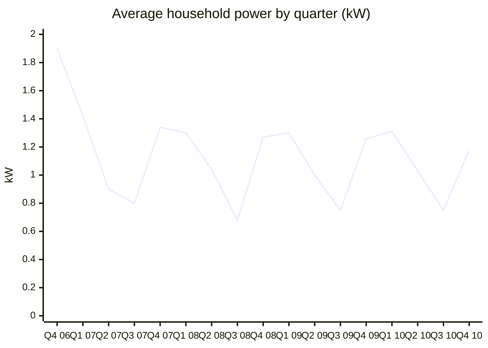
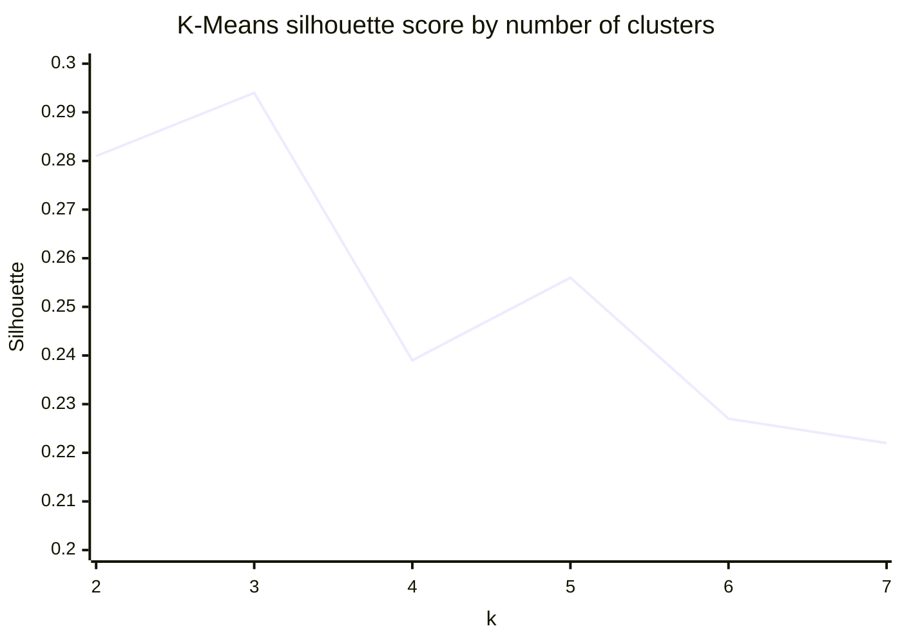

# Anomaly Detection and Smart Consumption Profiling in Energy Utility Data

**Can we automatically spot abnormal household energy use, group days into usage profiles, and forecast demand?** These are three everyday questions for an energy utility.

This project uses nearly **4 years of minute-level smart-meter data** from one household (the UCI *Individual Household Electric Power Consumption* dataset) to compare three anomaly detection methods, cluster daily consumption into profiles, classify demand spikes, and forecast daily load.



*Clear winter peaks and summer lows. Q4 2006 and Q4 2010 are partial quarters.*

## Key results

| Task | Method | Result |
|---|---|---|
| Data preparation | pandas | 2,075,259 minute readings → 2,049,280 after removing 25,979 incomplete rows (1.25%) → 1,433 daily profiles |
| Anomaly detection | Isolation Forest (tuned) | 15 anomalous days flagged (1% of days), average 2.57 kW vs a typical 1.09 kW |
| Anomaly detection | Local Outlier Factor | 15 anomalous days |
| Anomaly detection | Autoencoder (Keras) | Days above the 99th percentile of reconstruction error flagged. **6 days were flagged by all three methods** |
| Consumption profiling | K-Means | **3 profiles** chosen by silhouette score (best k = 3, silhouette 0.29): low-use, typical and high-use days |
| Spike classification | Random Forest (GridSearchCV) | 94% accuracy. High-usage precision 0.93, **recall 0.47** (see limitations) |
| Load forecasting | Prophet (tuned) | **MAE 0.20 kW, RMSE 0.26 kW** on a chronological 20% hold-out |

**What this means**

- **Where the methods agree, the flag is more trustworthy.** Different detectors pick up different kinds of unusual days, and a day flagged by more than one method is the strongest candidate for investigation.
- **Usage falls into three profiles.** The high-use profile (about 1.7 kW average) stands out for much heavier kitchen and laundry use (sub-meters 1 and 2). That's useful for targeting tariffs or demand-response offers.
- **Seasonal forecasting works well.** Prophet with yearly and weekly seasonality forecasts daily demand to within about 0.2 kW on unseen data.



*k = 3 scores highest, so the days are grouped into three consumption profiles.*

## Approach

1. **Ingest and clean.** Parse the semicolon-separated file, combine the date and time into a datetime index, turn `?` into missing values, and drop incomplete rows.
2. **Explore (EDA).** Summary statistics, a correlation heatmap, distributions, a 7-day rolling mean and standard deviation, and sub-metering trends.
3. **Detect anomalies** on the daily average active power:
   - Isolation Forest, tuned with GridSearchCV plus a manual search over `n_estimators`, `contamination` and `max_samples`
   - Local Outlier Factor (k = 20)
   - A dense autoencoder (8-4-8) trained on scaled daily power, with thresholds based on reconstruction error
   - Comparison of the three methods with a Venn diagram and anomaly counts
4. **Profile consumption.** Build daily features (active power, voltage, current and three sub-meters), scale them, test K-Means for k = 2–7 with the elbow and silhouette methods, and visualise the clusters with a pairplot.
5. **Classify spikes.** Label a day as high-usage when its power is more than 1.3× its 7-day rolling mean. Then train a Random Forest with a stratified 5-fold grid search and evaluate it with a confusion matrix and ROC curve.
6. **Forecast.** Fit Prophet with multiplicative yearly and weekly seasonality on the first 80% of days, and test it on the last 20%.

## Limitations and what I'd improve

- **The classifier misses about half of the spikes** (recall 0.47), because only about 10% of days are spikes. Next steps: class weights or resampling, tuning the decision threshold, and optimising for F1 or recall instead of accuracy.
- **The classifier's train/test split is random.** Because the target uses rolling features, a time-based split would give a more realistic estimate.
- **Anomalies are unsupervised.** There are no ground-truth labels, so the `contamination` setting decides how many days get flagged. Agreement between methods is used as a proxy for confidence.
- **It's a single household.** A real utility would apply this across many meters, which is a job for distributed tools such as Spark.

**Random Forest confusion matrix (test set, 287 days)**

| | Predicted low usage | Predicted high usage |
|---|---|---|
| **Actual low usage** | 256 | 1 |
| **Actual high usage** | 16 | 14 |

*Full charts (anomaly plots, method overlap, forecasts) are in the notebook.*

## Data

[UCI Machine Learning Repository: Individual Household Electric Power Consumption](https://archive.ics.uci.edu/dataset/235/individual+household+electric+power+consumption). One household near Paris, measured every minute from December 2006 to November 2010. The zipped dataset is included in this repo.

## Tech stack

Python · pandas · NumPy · scikit-learn · TensorFlow/Keras · Prophet · Matplotlib · Seaborn · Google Colab

## Run it

```bash
pip install pandas numpy scikit-learn tensorflow prophet matplotlib seaborn matplotlib-venn
unzip "individual+household+electric+power+consumption (1).zip"
```

Set `file_path` in the notebook to the extracted `household_power_consumption.txt`, and skip the Google Drive mount cell if you're running it locally.

---
**Author:** Harish Shanmughan, MSc Data Science · [GitHub](https://github.com/Hais002)
